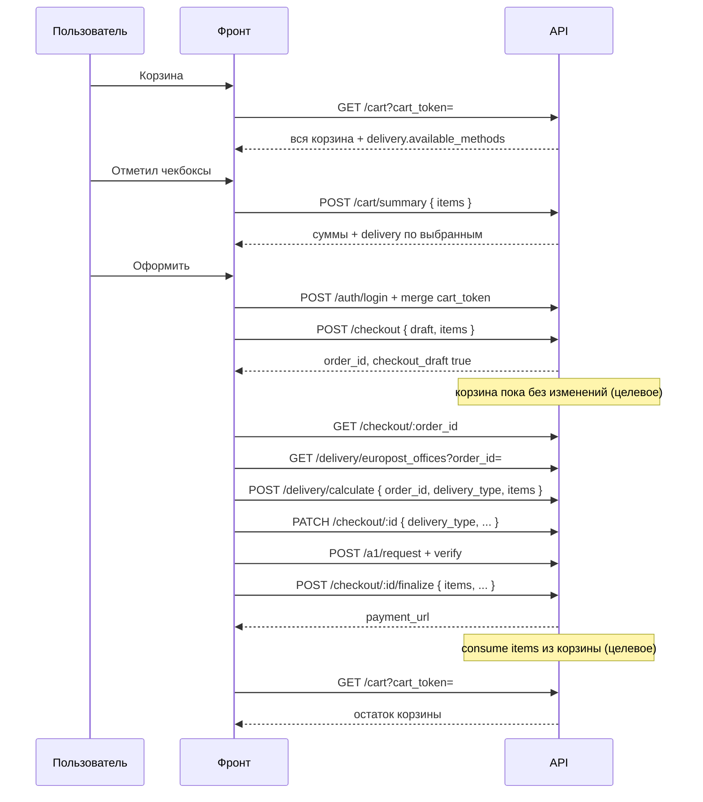

# Корзина и оформление: целевой сценарий (фронт + бэк)

Единый контракт для частичного оформления (чекбоксы), гостевой корзины и многошагового checkout.

**Связанные документы:** [CART_DELIVERY_API_FOR_FRONTEND.md](./CART_DELIVERY_API_FOR_FRONTEND.md), [CHECKOUT_DRAFT_FRONTEND.md](./CHECKOUT_DRAFT_FRONTEND.md).

---

## 1. Принципы

| Правило | Описание |
|--------|----------|
| **Полная корзина** | `GET /cart` — всегда все позиции в корзине по `cart_token` / сессии пользователя |
| **Выбранные позиции** | Один массив `items: [{ sku, quantity }]` для summary, draft, delivery, finalize |
| **Контекст checkout** | После создания черновика источник истины — **`order_id` черновика**, не остаток корзины по `cart_token` |
| **Снятие с корзины** | Оформленные SKU/qty убираются из корзины **только после успешного `finalize`** (не при `draft`) |
| **Активный черновик** | Не более одного `checkout_draft: true` на пользователя; перед новым набором — завершить, отменить или продолжить старый |
| **Авторизация** | Checkout (`POST/PATCH/finalize`) — только с **JWT**; гость работает с корзиной по `cart_token`, перед checkout — логин + merge |
| **Доставка на корзине** | Только данные из `GET /cart` / `POST /cart/summary`; **`POST /delivery/calculate` на экране корзины не вызывать** |

### Контекст запросов (шпаргалка)

| Этап | Идентификация корзины | Состав для расчёта |
|------|------------------------|-------------------|
| Корзина, чекбоксы | `cart_token` / cookie / заголовок | `GET /cart` — всё; `POST /cart/summary` — `items` |
| Checkout (после draft) | `Authorization` + **`order_id`** | Строки **черновика** (= те же `items`, что при создании) |
| Delivery на checkout | `order_id` **или** `items` (без привязки к остатку корзины) | Только выбранные при оформлении |
| После `finalize` | `cart_token` | `GET /cart` — неоформлённое осталось |

---

## 2. Схема потока



---

## 3. Пошаговый сценарий с примерами

Ниже — **целевой** контракт. Блок **«Сейчас на бэке»** — отличия от текущей реализации.

---

### Шаг 0. Идентификация корзины

**Фронт:** хранит `cart_token`, передаёт в query или body, дублирует в заголовке `X-Cart-Token` (рекомендуется).

**Бэк:** без изменений (`CartTokenResolver`).

---

### Шаг 1. Загрузка корзины

```http
GET /api/v1/cart?cart_token=abc123def456
X-Cart-Token: abc123def456
```

**Ответ 200** (сокращённо):

```json
{
  "cart": {
    "token": "abc123def456",
    "expires_at": "2026-06-22T12:00:00Z",
    "items_count": 3,
    "items": [
      {
        "sku": "90205097",
        "quantity": 2,
        "available": true,
        "issue_reason": null,
        "product": { "sku": "90205097", "name": "..." },
        "pricing": {
          "unit_price_new_byn": "45.90",
          "line_total_new_byn": "91.80",
          "customs_total_byn": "0.00"
        }
      },
      {
        "sku": "09588114",
        "quantity": 1,
        "available": true,
        "pricing": { "line_total_new_byn": "120.00" }
      }
    ],
    "totals": {
      "items_total_byn": "211.80",
      "delivery_poland_byn": "12.00",
      "delivery_to_belarus_byn": "18.50",
      "delivery_total_byn": "30.50",
      "total_byn": "242.30",
      "total_weight_kg": 15.2
    },
    "delivery": {
      "pricing_source": "internal_cart",
      "total_weight_kg": 15.2,
      "delivery_to_belarus_byn": "18.50",
      "delivery_total_byn": "30.50",
      "available_methods": [
        { "code": "europost_pickup", "available": true, "reason": null },
        { "code": "courier", "available": true, "reason": null },
        { "code": "ikeya_delivery", "available": true, "reason": null }
      ],
      "europost_eligible": true,
      "ineligible_reason": null
    },
    "rules": {
      "min_order_amount_byn": "150.00",
      "free_delivery_threshold_byn": "500.00"
    },
    "flags": {
      "checkout_allowed": true,
      "min_order_missing_byn": "0.00"
    }
  }
}
```

**Фронт:** UI цен строк — `items[].pricing`; минимальный заказ на корзине — `rules` / `flags` (для выбранных — шаг 3).

**Бэк:** без изменений.

---

### Шаг 2. Изменение состава корзины

```http
POST /api/v1/cart_items
Content-Type: application/json

{
  "cart_token": "abc123def456",
  "sku": "90205097",
  "quantity": 1
}
```

```http
PATCH /api/v1/cart_items/90205097
{ "cart_token": "abc123def456", "quantity": 2 }
```

```http
DELETE /api/v1/cart_items/90205097?cart_token=abc123def456
```

```http
DELETE /api/v1/cart_items
{
  "cart_token": "abc123def456",
  "skus": ["90205097"],
  "delete_all": false
}
```

**Ответ:** тот же формат, что `GET /cart` (можно не делать лишний `GET`, если удобно обновить state из тела).

**Фронт:** после изменения сбросить/пересчитать выбранные чекбоксы, если SKU исчез или qty уменьшился.

**Бэк:** без изменений.

---

### Шаг 3. Чекбоксы — summary только по выбранным

```http
POST /api/v1/cart/summary
Content-Type: application/json

{
  "cart_token": "abc123def456",
  "items": [
    { "sku": "90205097", "quantity": 1 },
    { "sku": "09588114", "quantity": 1 }
  ]
}
```

**Ответ 200:**

```json
{
  "items": [
    {
      "sku": "90205097",
      "quantity": 1,
      "pricing": {
        "unit_price_new_byn": "45.90",
        "line_total_new_byn": "45.90",
        "line_discount_byn": "0.00"
      }
    },
    {
      "sku": "09588114",
      "quantity": 1,
      "pricing": {
        "unit_price_new_byn": "120.00",
        "line_total_new_byn": "120.00"
      }
    }
  ],
  "items_count": 2,
  "subtotal_new_byn": "165.90",
  "discount_total_byn": "0.00",
  "customs_total_byn": "0.00",
  "delivery_to_belarus_byn": "14.20",
  "delivery_total_byn": "22.10",
  "total_weight_kg": 9.8,
  "total_byn": "188.00",
  "delivery": {
    "available_methods": [
      { "code": "europost_pickup", "available": true, "reason": null },
      { "code": "courier", "available": true, "reason": null },
      { "code": "ikeya_delivery", "available": true, "reason": null }
    ],
    "europost_eligible": true,
    "delivery_to_belarus_byn": "14.20",
    "delivery_total_byn": "22.10"
  },
  "meta": {
    "min_order_amount_byn": "150.00",
    "checkout_allowed": true,
    "min_order_error": null
  }
}
```

**Ответ 422** (товара нет в корзине):

```json
{
  "error": "Товар 99999999 отсутствует в корзине",
  "code": "item_not_in_cart",
  "sku": "99999999"
}
```

**Фронт:** сохранить массив `items` как `checkoutSelection` до конца оформления; `qty` не больше, чем в корзине; при `checkout_allowed: false` блокировать кнопку «Оформить».

**Бэк:** без изменений.

---

### Шаг 4. Вход и merge (обязательно перед checkout)

```http
POST /api/v1/auth/login
{ "phone": "...", "password": "..." }
```

С `cart_token` гостя бэк мержит корзину в `user.cart` (как сейчас в `CartMergeService`).

**Фронт:** явный экран «Войдите, чтобы оформить»; после логина повторить `GET /cart` уже без гостевого токена или с тем же токеном до истечения сессии.

**Бэк:** без изменений.

---

### Шаг 5. Создание черновика

```http
POST /api/v1/checkout
Authorization: Bearer <jwt>
Content-Type: application/json

{
  "draft": true,
  "items": [
    { "sku": "90205097", "quantity": 1 },
    { "sku": "09588114", "quantity": 1 }
  ]
}
```

**Ответ 201:**

```json
{
  "message": "Черновик заказа создан",
  "order_id": 42,
  "order": {
    "checkout_draft": true,
    "status": "created",
    "total_amount": "188.00",
    "delivery_price": "22.10",
    "payment_url": null,
    "order_items": [
      { "product_sku": "90205097", "quantity": 1, "price": "45.90" },
      { "product_sku": "09588114", "quantity": 1, "price": "120.00" }
    ]
  },
  "delivery_options": {
    "methods": [
      { "code": "europost_pickup", "available": true, "reason": null }
    ],
    "cart_vgh": { "eligible_for_europost": true }
  }
}
```

**Целевое поведение:** корзина **не меняется** (в примере по-прежнему 2×90205097 и 1×09588114, пока не finalize).

**Конфликт черновика:**

| Ситуация | HTTP | Тело |
|----------|------|------|
| Нет черновика | 201 | новый `order_id` |
| Тот же `items`, что в активном черновике | 200 | тот же `order_id` (идемпотентность) |
| Другой набор `items` | 201 | старый черновик отменён, новый `order_id`, суммы пересчитаны |

**Фронт:** сохранить новый `order_id` из ответа; старый id черновика больше не активен.

---

### Шаг 6. Получение черновика (reload / deep link)

**Целевое (добавить на бэке):**

```http
GET /api/v1/checkout/42
Authorization: Bearer <jwt>
```

**Ответ 200:** заказ + `order_items` + `checkout_draft: true`.

**Фронт:** на mount checkout-страницы — `GET /checkout/:order_id`; при 404 — новый flow с корзины.

---

### Шаг 7. Список ПВЗ Европочты

Вызывать **только если** в summary/draft: `europost_eligible: true` и `europost_pickup.available: true`.

**Целевое:**

```http
GET /api/v1/delivery/europost_offices?order_id=42
Authorization: Bearer <jwt>
```

Альтернатива до draft (на корзине):

```http
GET /api/v1/delivery/europost_offices?cart_token=abc123def456&items=[{"sku":"90205097","quantity":1}]
```

(формат `items` — согласовать: query JSON или только `order_id` после draft.)

**Ответ 200** (фрагмент):

```json
{
  "offices": [
    {
      "id": "70130010",
      "external_id": "70130010",
      "name": "ПВЗ Минск-1",
      "city": "Минск",
      "address": "ул. Примерная, 1",
      "phone": "+375295353636",
      "lat": 53.9,
      "lng": 27.5,
      "available_for_cart": true,
      "delivery_price_byn": "8.50",
      "delivery_to_belarus_price_byn": "14.20",
      "total_delivery_price_byn": "22.10",
      "delivery_date": "2026-05-28",
      "storage_until": "2026-06-04"
    }
  ]
}
```

**Фронт:** после шага 5 **не** использовать `cart_token` без `order_id` для ПВЗ.

**Бэк:** поддержать фильтрацию offices по `items` (subset cart); на checkout достаточно `order_id` (уже есть).

---

### Шаг 8. Расчёт доставки на checkout

**Целевое правило приоритета контекста:**

1. `order_id` (черновик)  
2. иначе `items` (явный subset)  
3. иначе `cart_token` → **вся** корзина (только этап корзины, без checkout)

**ПВЗ Европочты:**

```http
POST /api/v1/delivery/calculate
Content-Type: application/json

{
  "order_id": 42,
  "delivery_type": "europost_pickup",
  "pickup_point_id": "70130010",
  "items": [
    { "sku": "90205097", "quantity": 1 },
    { "sku": "09588114", "quantity": 1 }
  ]
}
```

**Ответ 200** (фрагмент):

```json
{
  "basis": {
    "total_weight_kg": 9.8,
    "subtotal_byn": "165.90"
  },
  "delivery": {
    "type": "europost_pickup",
    "normalized_delivery_type": "europost_pickup",
    "available": true,
    "delivery_price_byn": "8.50",
    "delivery_to_belarus_price_byn": "14.20",
    "total_delivery_price_byn": "22.10",
    "delivery_date": "2026-05-28",
    "storage_until": "2026-06-04",
    "pricing": {
      "source": "europost_api",
      "internal": { "poland_delivery_byn": "7.90", "belarus_delivery_byn": "14.20" },
      "europost": { "success": true, "postal_total_byn": "8.50" }
    }
  },
  "pickup_point": {
    "id": "70130010",
    "eligible": true,
    "reasons": []
  }
}
```

**Курьер (адрес):**

```http
POST /api/v1/delivery/calculate
{
  "order_id": 42,
  "delivery_type": "courier",
  "items": [ ... ],
  "address": {
    "city": "Минск",
    "street": "Ленина",
    "house": "10",
    "apartment": "12",
    "entrance": "1",
    "floor": "3",
    "elevator_type": "passenger",
    "lat": 53.9,
    "lng": 27.56,
    "full_address": "Минск, Ленина 10"
  }
}
```

**Ответ 422** (тип недоступен по ВГХ):

```json
{
  "error": "Выбранный тип доставки недоступен для текущей корзины",
  "delivery_type": "courier",
  "normalized_delivery_type": "courier",
  "reason": "max_weight_exceeded",
  "available_methods": [
    { "code": "europost_pickup", "available": false, "reason": "max_weight_exceeded" },
    { "code": "courier", "available": false, "reason": "max_weight_exceeded" },
    { "code": "ikeya_delivery", "available": true, "reason": null }
  ]
}
```

**Фронт:** при 422 и `ikeya_delivery.available: true` — один повтор с `delivery_type: "ikeya_delivery"` и тем же `order_id` + `items`. Не предлагать europost/courier, если в `available_methods` только `ikeya_delivery`.

**Фронт:** на checkout использовать `order_id`; на корзине — `cart_token` + `items` для subset.

**Сохранение выбора (рекомендуется):**

```http
PATCH /api/v1/checkout/42
Authorization: Bearer <jwt>

{
  "delivery_type": "europost_pickup",
  "pickup_point_id": "70130010",
  "payment_method": "card"
}
```

Чтобы после F5 не потерять доставку без повторного calculate.

---

### Шаг 9. Верификация A1

**Целевой контракт (единый для фронта и бэка):**

```http
POST /api/v1/a1/request
{ "phone": "375291234567", "context": "checkout" }
```

**Ответ 201:**

```json
{
  "verification_id": 1001,
  "phone": "375291234567",
  "display_message": "Введите последние 4 цифры номера, с которого поступил звонок",
  "caller_number_masked": "+375 (**) ***-**-1234",
  "expires_at": "2026-05-22T15:10:00Z"
}
```

```http
POST /api/v1/a1/verify
{
  "verification_id": 1001,
  "last4": "1234"
}
```

**Ответ 200:** `{ "success": true }` — для checkout сохранить `verification_id` / обновление `user.a1_verification_id` на бэке при авторизованном пользователе.

**Фронт:** не использовать пути `/account/a1_verification/...` и поле `code` вместо `last4`, пока бэк не добавит алиасы.

**Бэк (опционально):** алиасы `POST /account/a1_verification/request|verify` и приём `code` как синоним `last4`.

---

### Шаг 10. Финальное оформление

```http
POST /api/v1/checkout/42/finalize
Authorization: Bearer <jwt>
Content-Type: application/json

{
  "full_name": "Иван Иванов",
  "phone": "375291234567",
  "delivery_type": "europost_pickup",
  "payment_method": "card",
  "pickup_point_id": "70130010",
  "a1_verification_id": "1001",
  "services": ["furniture_delivery"],
  "items": [
    { "sku": "90205097", "quantity": 1 },
    { "sku": "09588114", "quantity": 1 }
  ]
}
```

**Ответ 201:**

```json
{
  "message": "Заказ успешно оформлен",
  "order_id": 42,
  "order": {
    "checkout_draft": false,
    "status": "processing",
    "payment_url": "https://api.example.com/api/v1/payment_links/42?token=...",
    "payment_expires_at": "2026-05-23T12:00:00Z",
    "public_uid": "4829103"
  }
}
```

**Ответ 422** (несовпадение items):

```json
{
  "error": "Список товаров не совпадает с черновиком заказа",
  "code": "items_mismatch"
}
```

**Фронт:** редирект на `payment_url`; `cart_token` **не** удалять.

---

### Шаг 11. Корзина после оплаты

```http
GET /api/v1/cart?cart_token=abc123def456
```

**Ожидаемый ответ:** оформленные SKU уменьшены/удалены; неоформлённые остались (в примере: `90205097` qty 1, если было 2 и оформили 1).

---

### Шаг 12. Отмена черновика (опционально)

```http
DELETE /api/v1/checkout/42
Authorization: Bearer <jwt>
```

**Ответ 204.** Товары черновика возвращаются в корзину (как сейчас в `CheckoutService.cancel_draft`).

**Фронт:** кнопка «Вернуться в корзину» / отмена оформления.

---

## 4. Сводная таблица эндпоинтов

| # | Метод | Путь | Auth | Ключевые параметры |
|---|--------|------|------|-------------------|
| 1 | GET | `/cart` | опционально | `cart_token` |
| 2 | POST/PATCH/DELETE | `/cart_items` | опционально | `cart_token`, `sku`, `quantity` |
| 3 | POST | `/cart/summary` | опционально | `cart_token`, **`items`** |
| 4 | POST | `/auth/login` | — | + merge `cart_token` |
| 5 | POST | `/checkout` | **да** | `draft: true`, **`items`** |
| 6 | GET | `/checkout/:id` | **да** | целевой |
| 7 | GET | `/delivery/europost_offices` | опционально | **`order_id`** или subset |
| 8 | POST | `/delivery/calculate` | опционально | **`order_id`**, `items`, `delivery_type` |
| 9 | PATCH | `/checkout/:id` | **да** | доставка, контакты |
| 10 | POST | `/a1/request`, `/a1/verify` | опционально | `last4` |
| 11 | POST | `/checkout/:id/finalize` | **да** | **`items`**, доставка, A1 |
| 12 | GET | `/cart` | опционально | после finalize |
| — | DELETE | `/checkout/:id` | **да** | отмена черновика |

---

## 5. Удалённые эндпоинты (не использовать)

| Метод | Путь | Замена |
|--------|------|--------|
| GET | `/api/v1/checkout/draft` | `GET /api/v1/checkout/:order_id` |
| GET | `/api/v1/delivery/pickup_points` | `GET /api/v1/delivery/europost_offices?order_id=…` или `cart_token` + `items` |
| GET | `/api/v1/delivery/pickup_points_search` | то же |
| GET | `/api/v1/delivery/europost_offices` без контекста | обязателен `order_id`, `cart_token` и/или `items` |
| GET | `/api/v1/delivery/europost_offices?cart_id=` | `cart_token` или `order_id` |

## 6. Что менять на фронте

| # | Задача |
|---|--------|
| F1 | Перед checkout — логин + merge гостевой корзины |
| F2 | Хранить `checkoutSelection` (`items`) и `order_id` после draft |
| F3 | На checkout: `order_id` + `items`, **без** `cart_token` в delivery |
| F4 | После draft: при смене `items` — сохранять новый `order_id` из **201** (старый черновик отменяется на бэке) |
| F5 | При mount checkout — `GET /checkout/:id` + при смене доставки `PATCH` или повторный calculate |
| F6 | Минимальный заказ для чекбоксов — из `cart/summary.meta`, не из полного `GET /cart` |
| F7 | A1: `/api/v1/a1/request` + `/a1/verify` + поле `last4` |
| F8 | Не вызывать `delivery/calculate` на экране корзины |
| F9 | `cart_token` не удалять после заказа; обновить корзину через `GET /cart` |

---

## 7. Коды ошибок (ориентир для UI)

| code | Когда | Действие UI |
|------|--------|-------------|
| `items_required` | summary/checkout без items (когда обязательны) | Подсветить выбор |
| `item_not_in_cart` | SKU не в корзине | Сбросить чекбокс |
| `items_mismatch` | finalize items ≠ черновик | Взять items из `GET /checkout/:id` |
| `checkout_draft_exists` | одношаговый checkout при активном черновике | Завершить / отменить черновик |
| `draft_not_found` | неверный order_id | Начать с корзины |
| 422 delivery | тип недоступен | fallback `ikeya_delivery` или смена способа |
| `passport_verification_required` | паспорт | A1 flow |

---

## 8. Минимальный happy-path (чеклист интеграции)

1. `GET /cart` — полная корзина.  
2. `POST /cart/summary` с 2 SKU → `checkout_allowed: true`.  
3. Login с `cart_token`.  
4. `POST /checkout` `{ draft: true, items }` → `order_id=42`, **корзина без изменений**.  
5. `GET /checkout/42` — состав черновика.  
6. `GET /delivery/europost_offices?order_id=42`.  
7. `POST /delivery/calculate` с `order_id` + `items` + ПВЗ.  
8. `PATCH /checkout/42` с доставкой.  
9. `POST /checkout/42/finalize` с теми же `items` → `payment_url`.  
10. `GET /cart` — остался только неоформленный остаток.

---

*Версия документа: 2026-05-22 (реализовано на бэке).*
